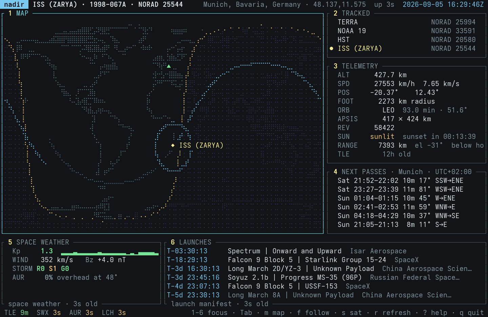

# nadir

A terminal application that tracks a satellite overhead in real time, with a
world map, a telemetry readout, upcoming passes over your location, and some
space-weather and launch numbers on the side. It's a novelty project — but the
orbital mechanics under it are the real thing: it runs SGP4/SDP4 locally and
only ever fetches an orbit description, never a position.

*Nadir* is the point on Earth directly beneath a satellite, which is what the
centerpiece map tracks.



> **Note:** this project is entirely AI-generated. No line of it was written or
> reviewed by hand. Treat it accordingly.

## How it works

Orbital state is computed locally rather than downloaded. Celestrak supplies a
GP/TLE element set — a compact orbit description valid for days, not a position
— and `src/orbit/propagate.rs` runs SGP4/SDP4 on it at ~4 Hz to get position and
velocity at any instant. Everything derived from that is math with no I/O:
ground track, footprint, sunlit/eclipsed state, look angles, the day/night
terminator and pass predictions.

Only the element set needs the network, and at most every 12 hours. It is cached
at `~/.cache/nadir/tle-<norad>.json` and keyed by cache age rather than process
lifetime, so a restart with a cache under 12h old reads from disk.

### Accuracy

A propagated position is an estimate, and it gets worse the further the
displayed time is from the element set's epoch — the more so once you start
scrubbing the clock days out. The telemetry panel's `ACC` row puts a number on
it. A TLE carries no formal error, so this is a model, built from what the
element set does reveal about its own quality: nadir re-propagates with the drag
term `B*` nudged by 10% and measures how far the position moves, then floors
that against a per-regime growth rate. The result is satellite-specific — a
decaying LEO degrades several times faster than a quiet orbit well above the
drag — and it lands near the long-standing rule of thumb of ~1 km at epoch
growing to tens of km after a week in low orbit. The along-track part is a
timing error, so it also shows as `±N s`, and as a footer on the pass list
bounding how far the AOS/LOS times could slip. Past 30 days from epoch the model
stops quoting a figure: SGP4 still returns a position, but nothing local can say
how wrong it is.

The remaining panels do need the network: space weather, the aurora nowcast, and
the launch manifest. Each source fails independently — a dead feed degrades its
own panel to the last known value, labelled with its age, and leaves the rest of
the dashboard alone. Every panel warm-starts from the disk cache at launch, so
nothing sits on a placeholder waiting for the session's first fetch.

`--offline` makes no network requests at all and loads whatever each source last
cached. The map keeps tracking from the last cached TLE. Only the catalogue name
search is unavailable offline — a NORAD id still switches satellites, since
nothing has to be looked up first.

## Installing

Requires Rust 1.88 or newer, declared as `rust-version` in `Cargo.toml`. The
floor comes from the dependencies, not from nadir's own code: ratatui 0.30 and
the IDNA stack under reqwest both need 1.88, and `time` (pulled in by ratatui)
uses let-chains, which do not compile at all on 1.87.

```sh
git clone https://github.com/MatKier/nadir
cd nadir
cargo build --release
```

The binary is `target/release/nadir`, self-contained aside from network access.

## Running

```sh
cargo run --release -- --location "Munich"
# or
cargo run --release -- --lat 48.137 --lon 11.575
```

A first run with no location guesses one from your IP address and saves it to
`~/.config/nadir/config.toml`, which you can edit at any time. Needs an 80×24
terminal or larger.

```
--location <place>    ground station by name, e.g. "Munich" or "Springfield, Illinois"
--lat, --lon, --alt   ground station by coordinates (alt in metres); not with --location
--sat <name-or-id>    satellite to track — a NORAD id, or a catalogue name to search for
--config <path>       use a specific config file
--offline             make no network requests; use cached data only
--no-geoip            never guess location from IP, even with none configured
```

`--location` is resolved once at startup via Open-Meteo's geocoding API and the
result saved like a geolocated or hand-typed one. An ambiguous name takes the
most prominent match; add a country or state to disambiguate.

### Tracking other objects

nadir tracks the ISS by default. Any object in Celestrak's catalogue can be
tracked, by name or NORAD id:

- **At startup:** `--sat HST`, or a NORAD catalogue number such as
  `--sat 48274`. A name is resolved against Celestrak at startup and the
  top-ranked match is used; it has to be the object's official catalogue name
  (as listed at [celestrak.org/satcat/search.php](https://celestrak.org/satcat/search.php)),
  not a nickname.
- **In-app:** press `s`, type a name or NORAD id, press `Enter`. A name search
  lists every match — pick one with `↑`/`↓` and `Enter`. A NORAD id tracks the
  object directly.

Satellites you have tracked stay in the **TRACKED** panel (`2`), most recently
tracked first, so returning to one does not mean searching again: highlight it
and press `Enter`. `d` drops an entry; the satellite currently being tracked
cannot be dropped.

SGP4/SDP4 (via the `sgp4` crate, which implements both) covers all of Earth
orbit, including geostationary. It does not cover deep space — an object at a
Lagrange point such as JWST, or beyond Earth orbit, needs a different propagator
and will not work here.

## Keys

| Key | Action |
|---|---|
| `1`–`6` | focus map / tracked / telemetry / passes / weather / launches — each panel's header shows its number |
| `Tab` | cycle focus |
| `j` / `k` | scroll the focused panel's list (tracked, passes, launches) |
| `Enter` | on Tracked: start tracking the highlighted satellite |
| `d` / `Del` | on Tracked: drop the highlighted satellite from the list |
| `m` | toggle fullscreen map |
| `f` | follow the satellite (zoom the map on it) |
| `+` / `-` | zoom the follow window in / out (×2–×16); `-` past the widest drops back to the whole world |
| `p` | toggle labelled cities and ground stations on the map |
| `s` | search Celestrak's catalogue for another object, by name or NORAD id |
| `r` | refresh the focused panel's feed(s) now |
| `Space` | pause / resume the simulated clock |
| `,` / `.` | step the clock speed down / up (1× … 1800×), past 1× into reverse (`<` / `>` too) |
| `←` / `→` | step the clock ±1 minute (`h` / `l` too); `[` / `]` step ±1 hour |
| `n` / `N` | jump to 30 s before the next pass / next naked-eye pass, paused there |
| `g` | go to a time — `2026-09-08 04:30`, `04:30`, or an offset like `+90m` |
| `0` | snap the clock back to now, running at 1× |
| `?` | help — a scrollable in-app reference to every field, symbol and status chip |
| `q` / `Esc` | quit |

Focus affects behaviour as well as appearance. `j`/`k` scroll and highlight a row
in whichever panel has focus (Tracked, Passes and Launches have scrollable
lists), and `r` refetches only what the focused panel shows — focusing Weather
and pressing `r` forces a fresh Kp/aurora pull without spending one of the launch
feed's limited requests. Highlighting a launch expands its row to a second line
with provider and pad, and marks the pad on the map with `◉` plus the provider,
vehicle name, site and coordinates, for as long as the row stays highlighted.

The clock keys detach the display from wall time so you can watch a pass play
out, step to where the satellite will be, or run the ground track backwards.
Everything geometric follows the simulated clock — the map, telemetry, the pass
list, and the `TLE` and `ACC` fields, which is the point: scrub a week out and
`ACC` climbs into the tens of km so the confident-looking map can't mislead you.
What stays on the real clock: the feed-status chips and
their ages, session uptime, and the launch countdown — those track real events,
not the view. The title-bar clock turns amber with a marker (`▸` drifted, `‖`
paused, `▸▸60x` / `◂◂5x` warp) whenever it is not live, so the display can never
quietly claim to be current when it isn't.

While the `?` overlay is open, `j`/`k`/`PgUp`/`PgDn`/`Home`/`End` scroll it
instead, and `?` or `Esc` closes it.

## Reading the dashboard

The full glossary — map symbols, every telemetry field and space-weather term,
and what each status chip means — is available in-app by pressing `?`. The short
version:

**Tracked** — satellites you have tracked, most recently tracked first; `●`
marks the current one.

**Telemetry** — `ALT` altitude above the WGS-84 ellipsoid · `SPD` inertial speed
from SGP4, not ground-relative · `POS` sub-satellite lat/lon · `FOOT` radius of
the ground circle that can see the satellite above 0° elevation · `ORB` orbital
regime (LEO/MEO/GEO/GSO/HEO/HIGH) from altitude and eccentricity, plus a `-P`
(polar) or `-S` (sun-synchronous) suffix from inclination when it applies, and
period and inclination from the element set · `APSIS` perigee × apogee altitude,
measured from the WGS-84 equatorial radius rather than `ALT`'s local ellipsoid,
so the two can read up to ~20 km apart away from the equator · `REV` approximate
revolution number since launch · `SUN` sunlit/eclipsed and time to the next
transition · `RANGE` slant range and elevation from your ground station · `TLE`
time from the element-set epoch (reads *ahead* when the clock is scrubbed before
it) · `ACC` a modelled position error and the along-track timing error it
implies — see [Accuracy](#accuracy). The title bar also shows the satellite's
COSPAR international designator next to its NORAD id, when the terminal is wide
enough to fit it.

**Map** — the whole world by default; `f` zooms to a window centred on the
satellite, wrapping across the dateline to keep it dead centre. `+` / `-` step
that window through four magnifications — ×2, ×4, ×8, ×16 the whole-world scale,
shown as `MAP ×N` in the panel header — and `-` past the widest drops back to
the whole world. `◆` sub-satellite point · `▲` ground station · `◉` pad of the
launch currently highlighted in Launches, with its provider, site and
coordinates. `p` toggles a layer of labelled reference points — `·` cities and
`+` satellite ground stations — drawn as many as fit without overlapping, so a
whole-world map shows only a scattered few and more fill in as you zoom.

**Space weather** (NOAA SWPC) — `Kp` planetary K-index, 0–9 · `WIND` solar wind
speed · `Bz` north–south interplanetary field (strongly negative drives aurora) ·
`STORM R/S/G` NOAA's radio-blackout / radiation-storm / geomagnetic-storm scales,
0–5 · `AUR` aurora probability overhead at your ground station.

Space Weather and Launches show their feed's age under the panel title once it
has gone stale, e.g. `space weather · 1m old`.

**Status chips** (bottom left: `TLE` `SWX` `AUR` `LCH`) — each shows `wait`
(nothing fetched yet this session), `live`, an age such as `5s` / `12m` since
the last successful fetch, or `err` (failed with nothing to fall back on).
Colour is judged against how often that feed refetches: green while at most two
refreshes could have been missed, amber up to six, red beyond. So `SWX` (every
5m) is green to 10m and amber to 30m, `AUR` (15m) green to 30m and amber to 90m,
`LCH` (30m) green to 1h and amber to 3h, and `TLE` (12h) green to 24h and amber
to 72h.

## Data sources

All keyless; no account or API token is needed.

| Source | Supplies |
|---|---|
| [Celestrak](https://celestrak.org) | TLE element sets, propagated locally with SGP4 |
| [NOAA SWPC](https://www.swpc.noaa.gov) | K-index, solar wind, storm scales, aurora nowcast |
| [Launch Library 2](https://thespacedevs.com) | Upcoming launches (rate-guarded client-side; falls back to the public test mirror, `lldev.thespacedevs.com`, when the primary host throttles) |
| ipapi.co / ip-api.com | One-time IP geolocation on first run only |
| [Open-Meteo geocoding](https://open-meteo.com) | Resolves `--location "a place name"` to coordinates |

## Testing

```sh
cargo test                    # unit tests, all hermetic — no network
cargo test -- --ignored       # + the live tests, which do hit the network
```

The hermetic suite covers the geodesy, the SGP4 pipeline and pass prediction
against a fixed element set, plus the config store, catalogue-search ranking and
panel formatting.

The live tests are the ones worth running when the orbital mechanics change: one
propagates a freshly fetched TLE and asserts the result agrees with an
independent feed (WhereTheISS.at) to within 25 km and matches its eclipse state —
a check that the maths is correct rather than only internally consistent. The
others pin how Celestrak actually answers a catalogue search, including the 404
it returns for a name that matches nothing.

## Architecture

```
src/
  main.rs       CLI parsing only; hands a Config to app::run
  geo.rs        WGS-84 <-> ECEF, look angles — pure math, no I/O
  orbit/        SGP4 propagation, ground tracks, solar geometry, pass prediction
  api/          One module per upstream feed, all behind a shared HTTP client
  cache.rs      Disk cache so a flaky network / --offline still has data
  source.rs     Source<T>: a value plus how fresh and trustworthy it is
  config.rs     ~/.config/nadir/config.toml, overridable by CLI flags
  app.rs        Background fetch tasks, input handling, the render loop
  ui/           ratatui: the map, the ? overlay, and panels/ for the rest
```

Everything but `main.rs` sits behind a library target, so the integration test
drives the real propagation pipeline rather than a copy of it.

One tokio task per data source, each on its own interval, writing into shared
state behind a lock. The render loop never awaits the network, so a slow or dead
feed cannot stall the frame rate.

## License

MIT. See [LICENSE](LICENSE).
